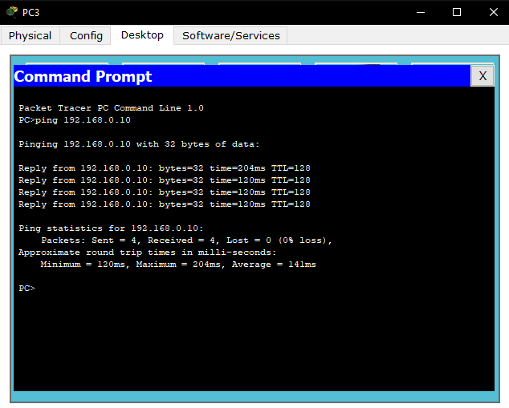
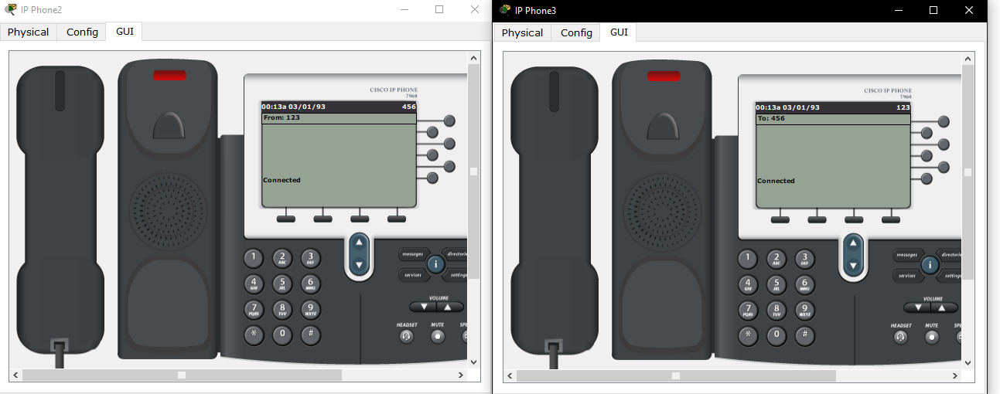

University: [ITMO University](https://itmo.ru/ru/)

Course: [IP-telephony](https://itmo-ict-faculty.github.io/ip-telephony/)

Year: 2024/2025

Group: K34212

Author: Ivakhnyuk Valeriy Sergeevich
Lab: Lab1

Date of create: 10.03.2025

Date of finished: 14.03.2025

## Отчет по лабораторной работе №1:
### "Базовая настройка ip-телефонов в среде Сisco packet tracer"

#### 1. Цель:
   Изучить рабочую среду Cisco Packet Tracer, ознакомиться с интерфейсами основных устройств, типами кабелей, научиться собирать,топологию. Изучить построение сети IP-телефонии с помощью маршрутизатора, коммутатора и IP телефонов Cisco 7960 в среде Packet tracer

#### 2. Ход работы:

**Часть 1.**

Схема для первой части работы представлена на рисунке ниже

Каждому компьютеру был задан статический ip адрес, по примеру PC0, представленному на рисунке ниже

После чего были проведены проверки связности между устройствами
  

**Часть 2.**

Схема второй части работы представлена на рисунке ниже.

Первым делом, включим телефоны в сеть на физическом представлении

Затем настроим роутер. Сконфигурируем DHCP-сервер, создав DHCP-пул 192.168.1.0/24, указан IP-адрес VLAN, соответствующий 192.168.1.1, и активирована опция 150, которая позволяет IP-телефонам получать настройки CallManager Express с TFTP-сервера. Далее была выполнена настройка самого telephony-service. В рамках этой настройки было задано максимальное количество номеров для IP-телефонов командой max-dn, максимальное количество поддерживаемых IP-телефонов командой max-ephones 5, а также указан IP-адрес голосового шлюза командой ip source-address. Затем было выполнено автоматическое назначение внешних номеров. Все указанные настройки представлены на рисунке ниже. После чего были заданы номера ip телефонов комаднами ehpone-dn и number.

На коммутаторе назначим для сети VLAN 1 диапазоны портов fa0/1-fa0/5 и переведем их в режиме access:

Проверим успешность настройки звонком с одного телефона на другой

