University: [ITMO University](https://itmo.ru/ru/)

Course: [IP-telephony](https://itmo-ict-faculty.github.io/ip-telephony/)

Year: 2024/2025

Group: K34212

Author: Ivakhnyuk Valeriy Sergeevich
Lab: Lab2

Date of create: 10.03.2025

Date of finished: 14.03.2025

## Отчет по лабораторной работе №2:
### "Конфигурация voip в среде Сisco packet tracer"

#### 1. Цель:
   Изучить построение сети IP-телефонии с помощью маршрутизатора Cisco 2811, коммутатора Cisco catalyst 3560 и IP телефонов Cisco 7960.

#### 2. Ход работы:

**Часть 1.**

Исходная схема представлена на рисунке ниже:

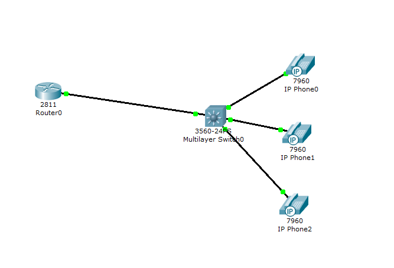

Сначала с помощью команды hostname CHERouter маршрутизатору было присвоено новое имя "CHERouter", затем командой no ip domain-lookup отключена функция поиска доменных имен для неверно введенных команд. Затем был активирован интерфейс FastEthernet0/0 IP-адрес 192.168.1.1 с маской 255.255.255.0. После чего был настроен DHCP-пул для голосовой сети командой ip dhcp pool voice, где указана с сетью 192.168.1.0 с маской 255.255.255.0, шлюзом по умолчанию 192.168.1.1 и включена опция 150 с IP-адресом 192.168.1.1 для настройки IP-телефонов.

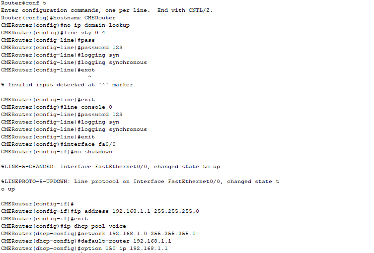

Порты коммутатора fa0/1-4 были переведены в режим access.

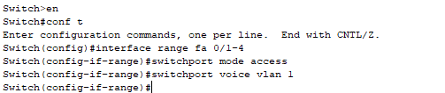

Затем настроены номера телефонов на маршрутизаторе.

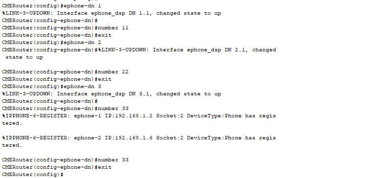

Проверка звонков представлена на рисунках ниже.

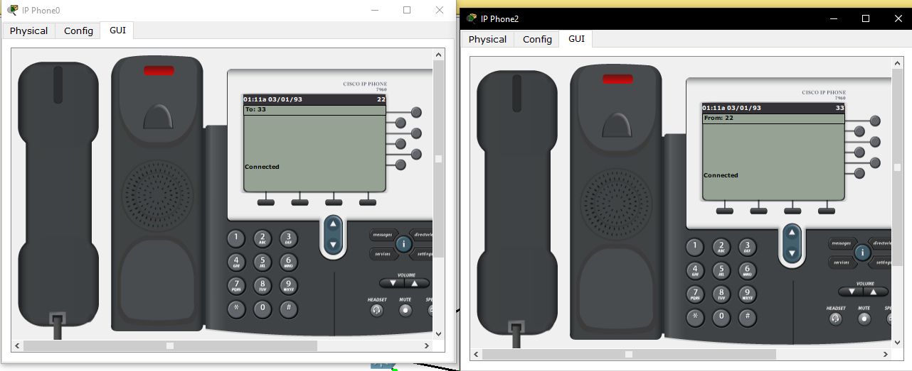

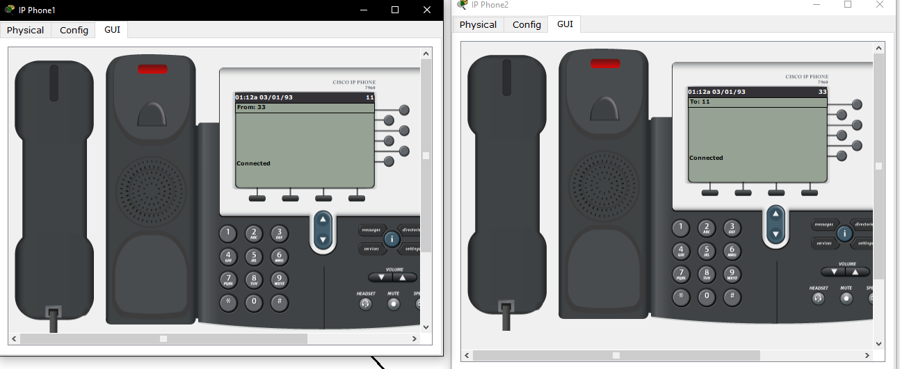

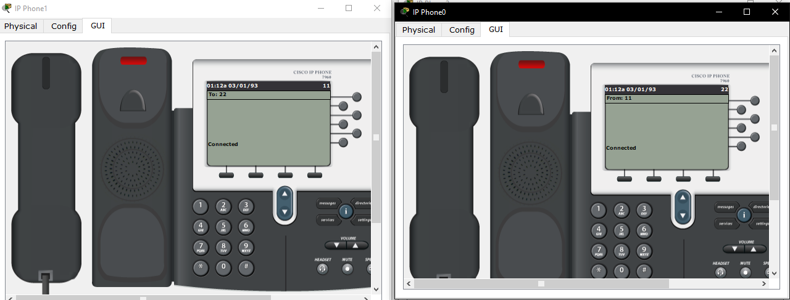

  **Часть 2.**

Во второй части лабораторной работы была собрана схема, состоящая из одного роутера, одного коммутатора, трех IP телефонов и трех персональных компьютеров. Полученная схема представлена на рисунке ниже:
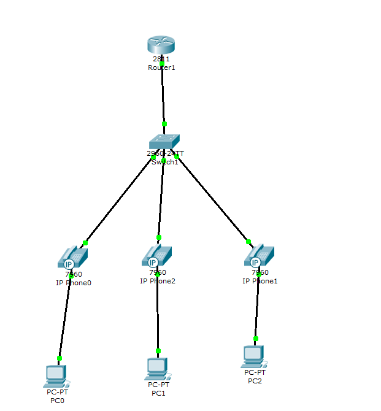

После составления схемы на коммутаторе были созданы вланы для звоноков и для данных. Порт fa0/1 был переведен в режим trunk, а порты fa0/2-4 в режим access. 

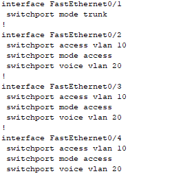

На коммутаторе настроены DHCP сервера как в предыдущей лабороторной для звонков и для компьютеров.

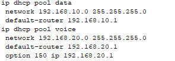

Затем, так же на коммутаторе, для вланов 10, 20 были созданы логические подынтерфейсы FastEthernet0/0.10 с инкапсуляцией Dot1Q для VLAN 10 и назначенным IP-адресом 192.168.10.1 и FastEthernet0/0.20 также инкапсуляцией Dot1Q для VLAN 20 и IP-адресом 192.168.20.1. Вслед за этим, для передачи голоса и данных на роутере были настроены DHCP-сервера. В конце на устройстве также была произведена настройка телефонного сервиса и заданы номера для всех IP-телефонов в сети: 11, 22 и 33.

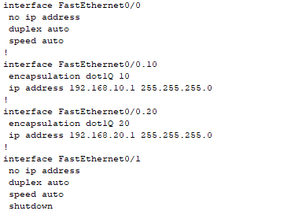

Выставим на компьютерах ip конфигурацию в DCHP, и проверим звонки и связность между устройствами.

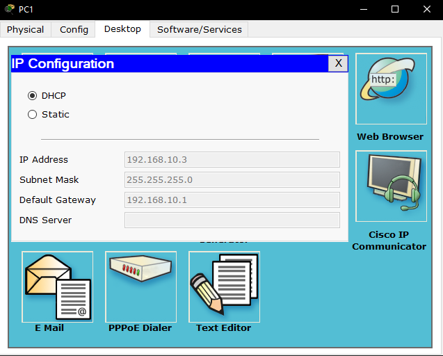
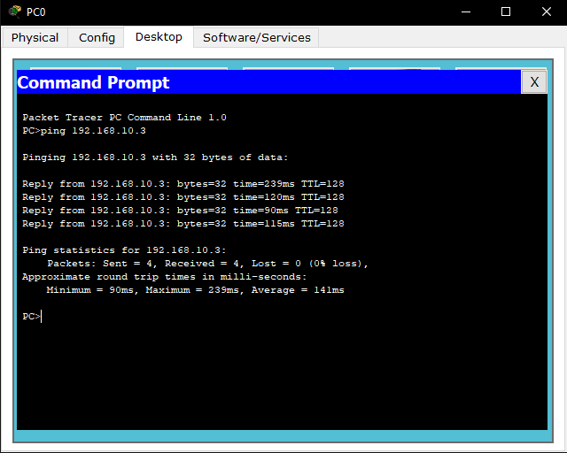 
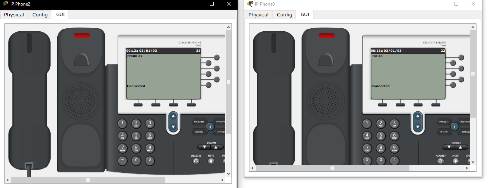

