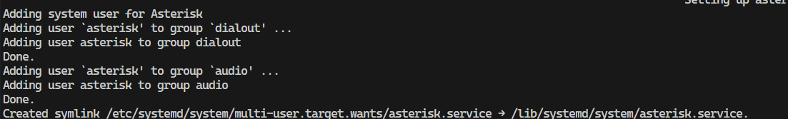
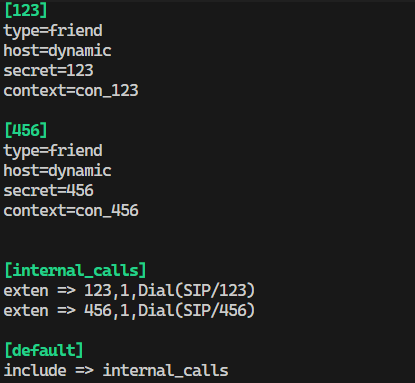
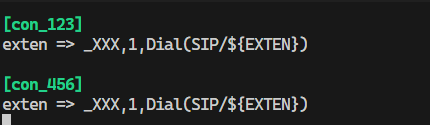
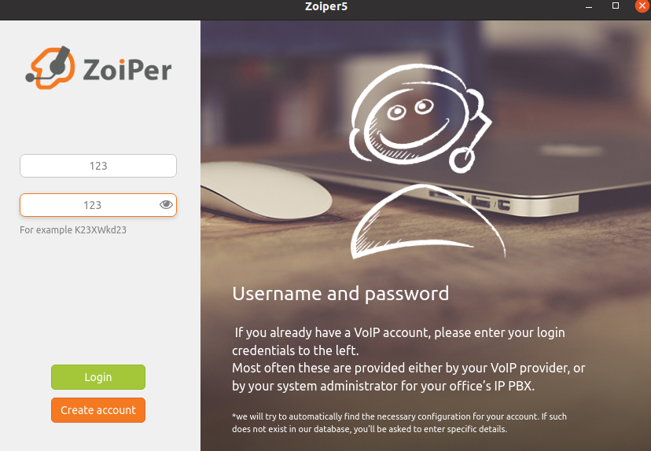
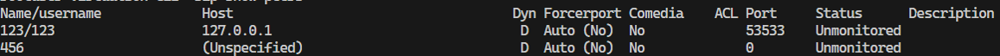
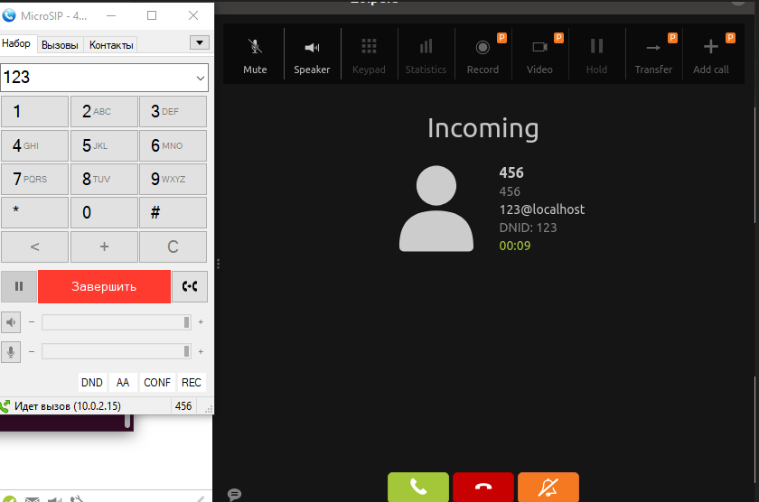

University: [ITMO University](https://itmo.ru/ru/)

Course: [IP-telephony](https://itmo-ict-faculty.github.io/ip-telephony/)

Year: 2024/2025

Group: K34212

Author: Ivakhnyuk Valeriy Sergeevich
Lab: Lab3

Date of create: 10.03.2025

Date of finished: 14.03.2025

## Отчет по лабораторной работе №1:
### "Использование Asterisk в качестве SIP proxy"

#### 1. Цель:
   Изучить программный комплекс Asterisk. Настройка Asterisk для локальных звонков.
#### 2. Ход работы:

Устанавливаем Asterisk

Конфигурируем телефоны в файлах sip.conf и extensions.conf

Устанавливаем Zoiper5 и входим под первым телефоном, используя данные которые были указаны в sip.conf

Проверяем подключение

Пробрасываем с виртуальной машины на хост машину порт asterisk 5060

Устанавливаем на хост машину MicroSIP и входим под вторым аккаунтом, после чего производим вызов на телефон, залогиненный в Zoiper5 - 123.

Звонок был произведен успешно, конфигурация работает верно.

#### Вывод
В ходе выполнения работы был успешно настроен Asterisk и произведена проверка связи между двумя soft телефонами, настроенными на нем.